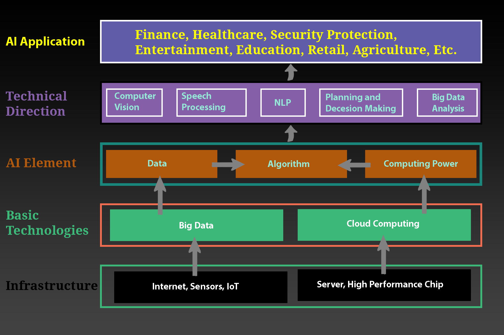

# Lesson 2 Industrial Transformation and Challenges
Artificial Intelligence (AI) is revolutionizing industries by automating processes, optimizing supply chains, and enhancing decision-making in sectors like manufacturing, healthcare, and logistics, driving unprecedented efficiency and innovation. AI-powered predictive maintenance reduces downtime, while intelligent robotics streamline production, and data analytics transform customer experiences. However, implementing AI faces challenges, including high costs of infrastructure and talent, data privacy and security concerns, ethical issues like algorithmic bias, and workforce displacement requiring reskilling. Additionally, integrating AI with legacy systems and ensuring regulatory compliance pose significant hurdles, necessitating strategic planning and robust governance to fully realize AI’s transformative potential.

## AI Industry Ecosystem
The AI industry ecosystem in 2025 is a complex, interconnected framework driving innovation across industries. Valued at approximately USD 279.22–391 billion and projected to reach USD 826.70–1,771.62 billion by 2030, the ecosystem comprises five key components: AI Applications, Technical Direction, AI Elements, Basic Technologies, and Infrastructure. These components work together to enable AI development, deployment, and impact, involving tech giants, startups, governments, and research institutions. This document provides detailed notes on each component, highlighting their roles, examples, and significance in the global AI landscape.

### AI Applications
AI applications are the practical, end-user-facing implementations of AI technologies that solve specific problems or enhance processes across industries. They represent the tangible outcomes of the AI ecosystem, driving economic and societal impact.

**Definition**: AI applications leverage machine learning (ML), natural language processing (NLP), computer vision, and other techniques to deliver solutions tailored to industry needs or consumer demands.

**Key Characteristics**:
- Industry-specific or cross-domain functionality.
- Focus on automation, personalization, and decision-making.
- Often built on top of AI platforms and infrastructure.

**Major Sectors and Examples**:
- **Healthcare**: AI-driven diagnostics (e.g., Enlitic’s medical imaging), drug discovery (BenevolentAI), and patient monitoring (AiCure).
- **Finance**: Fraud detection (Microsoft Azure AI), algorithmic trading (Palantir), and chatbots for customer service.
- **Retail/E-Commerce**: Personalized recommendations (Amazon, Netflix), inventory management, and dynamic pricing.
- **Automotive**: Autonomous vehicles (Waymo, Tesla), traffic optimization, and predictive maintenance.
- **Media/Entertainment**: Generative AI for content creation (OpenAI’s DALL·E, Runway), recommendation systems (Spotify), and gaming AI.
- **Cybersecurity**: Threat detection (Abnormal Security) and anomaly detection in networks.
- **Education**: Personalized learning platforms (Grammarly) and intelligent tutoring systems.
- **Agriculture**: Precision farming and crop yield prediction (John Deere, Blue River Technology).

**Impact**: AI applications contribute significantly to the global AI market, with 83% of companies prioritizing AI in 2025. The healthcare sector leads with the highest CAGR, while generative AI applications alone are projected to reach USD 1.3 trillion by 2032.

**Challenges**: Ethical concerns (e.g., bias in healthcare AI), data privacy, and regulatory compliance (e.g., EU AI Act).

### Technical Direction
Technical direction refers to the strategic focus areas and research trends guiding AI development. It shapes the evolution of AI capabilities and determines future applications.

**Definition**: Technical direction encompasses the methodologies, algorithms, and paradigms (e.g., deep learning, generative AI) that researchers and companies prioritize to advance AI.

**Key Trends in 2025**:
- **Generative AI**: Transformer-based models (e.g., GPT, Gemini 2.0) and diffusion models (e.g., Stable Diffusion 3) dominate, enabling text, image, and video generation.
- **Agentic AI**: Autonomous AI agents that make decisions and perform tasks independently are emerging as the next frontier.
- **Edge AI**: Real-time processing on devices (e.g., IoT sensors, smartphones) reduces latency and enhances privacy.
- **Ethical AI**: Focus on transparency, fairness, and explainability to address bias and regulatory demands.
- **Multimodal AI**: Systems integrating text, images, and audio (e.g., xAI’s Grok with image understanding) for versatile applications.
- **Quantum AI**: Early-stage integration of quantum computing for complex problem-solving (e.g., Zapata, D-Wave partnerships).
- **Key Players**: Google (Gemini 2.0), OpenAI (ChatGPT, Sora), xAI (Grok), and research labs like DeepMind and Stanford AI Lab.

**Impact**: Technical direction drives innovation, with generative AI and edge AI shaping industries like media, healthcare, and automotive. Ethical AI research addresses societal concerns, ensuring responsible deployment.

**Challenges**: Balancing innovation with safety, managing computational costs, and navigating regulatory fragmentation.

### AI Elements
AI elements are the core building blocks or components that enable AI systems to function, including algorithms, models, and data processing techniques.

**Definition**: AI elements are the foundational technologies and methodologies that underpin AI systems, enabling tasks like learning, reasoning, and perception.

**Key Elements**:
- **Machine Learning (ML)**: Algorithms like supervised, unsupervised, and reinforcement learning for pattern recognition and prediction.
- **Deep Learning (DL)**: Neural networks, including convolutional neural networks (CNNs) for images and recurrent neural networks (RNNs) for sequences.
- **Natural Language Processing (NLP)**: Techniques for text analysis, sentiment analysis, and language generation (e.g., BERT, GPT).
- **Computer Vision**: Image and video processing for object detection, facial recognition, and scene understanding.
- **Generative Models**: GANs, diffusion models, and transformers for creating content (e.g., DALL·E, Stable Diffusion).
- **Knowledge Representation**: Ontologies and knowledge graphs for reasoning and decision-making.
- **Robotics and Control Systems**: AI for physical automation, such as robotic arms and autonomous drones.

**Examples**:
- **Google’s Gemini 2.0** uses multimodal NLP and computer vision for search and analytics.
- **NVIDIA’s DL** frameworks power autonomous vehicle perception.
- **OpenAI’s GPT** models drive conversational AI applications.

**Impact**: AI elements enable the functionality of applications, with deep learning and NLP driving 60% of AI advancements in 2025. Open-source frameworks like TensorFlow and PyTorch democratize access.

**Challenges**: Scalability of complex models, data quality for training, and ethical issues in generative AI (e.g., copyright concerns).

### Basic Technologies
Basic technologies are the foundational tools, frameworks, and platforms that support AI development and deployment, acting as the backbone for AI elements and applications.

**Definition**: Basic technologies include programming languages, software frameworks, libraries, and platforms that developers use to build, train, and deploy AI models.

**Key Technologies**:
- **Programming Languages**: Python (dominant due to simplicity), R, and Julia for AI development.

**Frameworks and Libraries**:
- **TensorFlow (Google): Open-source ML framework for neural networks.
- **PyTorch (Meta AI): Preferred for research and dynamic computation graphs.
- **Hugging Face: Transformers library for NLP and generative AI.
- **LangChain: Framework for building applications with LLMs.

**Cloud Platforms**:
- **AWS (Amazon)**: Offers SageMaker for ML model development.
- **Azure AI (Microsoft)**: Provides enterprise-grade AI services.
- **Google Cloud AI**: Supports scalable AI deployment.
- **APIs and Tools**: xAI’s API for Grok, OpenAI’s API for ChatGPT, and DeepL’s translation APIs.
- **Simulation Platforms**: World Labs’ spatial intelligence tools for virtual environments.

**Impact**: Basic technologies lower barriers to AI development, enabling startups and enterprises to innovate. Open-source frameworks drive 70% of AI projects on GitHub in 2025.

**Key Players**: Google, Microsoft, Amazon, Meta AI, Hugging Face, and xAI.

**Challenges**: Compatibility with legacy systems, high costs of cloud computing, and ensuring accessibility for smaller organizations.

### Infrastructure
Infrastructure encompasses the hardware, computing resources, and data ecosystems that power AI development, training, and deployment.

**Definition**: AI infrastructure includes physical and virtual resources like GPUs, cloud computing, data storage, and networking systems that enable AI scalability.

**Key Components**:
#### Hardware:
- **GPUs/TPUs**: NVIDIA’s GPUs (e.g., H100) and Google’s TPUs dominate AI training and inference.
- **ASICs and FPGAs**: Specialized chips for energy-efficient AI processing.
- **Quantum Computers**: Emerging for specific AI tasks (e.g., D-Wave, IBM Quantum).

#### Cloud Computing:
- AWS, Azure, and Google Cloud provide scalable AI compute resources.
- Crusoe and Lambda offer energy-efficient AI cloud solutions.

#### Data Infrastructure:
- Big data platforms (e.g., Hadoop, Spark) for processing large datasets.
- Data lakes and warehouses for AI training data storage.
- **Networking**: High-speed networks for distributed AI training and edge AI deployment.
- **Edge Devices**: IoT sensors, smartphones, and embedded systems for real-time AI processing.

**Impact**: Infrastructure is critical for AI’s scalability, with NVIDIA’s GPUs powering 80% of AI workloads. Cloud computing supports 60% of enterprise AI deployments in 2025.

**Key Players**: NVIDIA, AMD, Intel, AWS, Crusoe, Lambda, Together AI.

**Challenges**:
- **High costs**: Training large models can cost millions (e.g., GPT-4 training estimated at USD 100 million).
- **Energy consumption**: AI data centers consume significant power, prompting sustainable solutions (e.g., Crusoe’s renewable energy focus).
- **Talent shortage**: Lack of skilled engineers to manage complex infrastructure.

The AI industry ecosystem in 2025 is a synergistic network of AI Applications, Technical Direction, AI Elements, Basic Technologies, and Infrastructure. Applications transform industries like healthcare and finance, driven by technical trends like generative and edge AI. AI elements (e.g., deep learning, NLP) are enabled by basic technologies (e.g., PyTorch, AWS) and powered by robust infrastructure (e.g., NVIDIA GPUs, cloud platforms). Despite challenges like cost, ethics, and regulation, the ecosystem is poised for exponential growth, with a projected market size of USD 1.77 trillion by 2030. Understanding these components and their interconnections is crucial for stakeholders aiming to innovate and navigate the AI landscape effectively.
