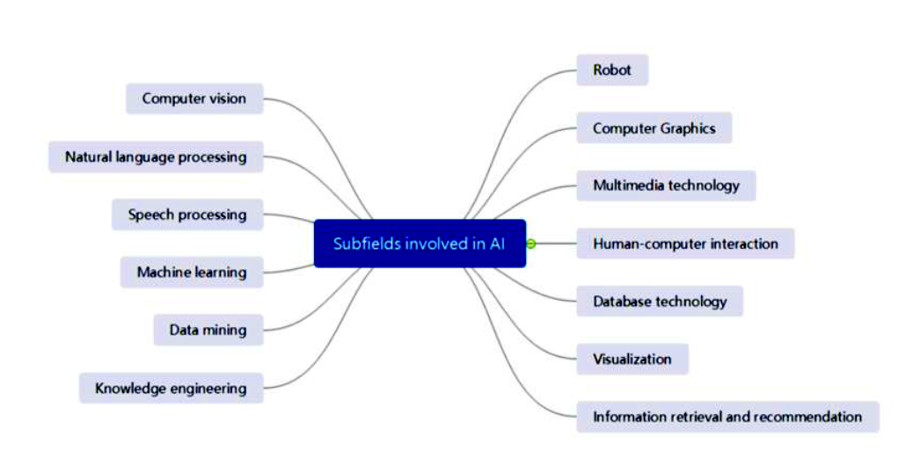

# Lesson 2 Industrial Transformation and Challenges
Artificial Intelligence (AI) is revolutionizing industries by automating processes, optimizing supply chains, and enhancing decision-making in sectors like manufacturing, healthcare, and logistics, driving unprecedented efficiency and innovation. AI-powered predictive maintenance reduces downtime, while intelligent robotics streamline production, and data analytics transform customer experiences. However, implementing AI faces challenges, including high costs of infrastructure and talent, data privacy and security concerns, ethical issues like algorithmic bias, and workforce displacement requiring reskilling. Additionally, integrating AI with legacy systems and ensuring regulatory compliance pose significant hurdles, necessitating strategic planning and robust governance to fully realize AI’s transformative potential.

## AI Industry Ecosystem
The AI industry ecosystem in 2025 is a complex, interconnected framework driving innovation across industries. Valued at approximately USD 279.22–391 billion and projected to reach USD 826.70–1,771.62 billion by 2030, the ecosystem comprises five key components: AI Applications, Technical Direction, AI Elements, Basic Technologies, and Infrastructure. These components work together to enable AI development, deployment, and impact, involving tech giants, startups, governments, and research institutions. This document provides detailed notes on each component, highlighting their roles, examples, and significance in the global AI landscape.

### AI Applications
AI applications are the practical, end-user-facing implementations of AI technologies that solve specific problems or enhance processes across industries. They represent the tangible outcomes of the AI ecosystem, driving economic and societal impact.

**Definition**: AI applications leverage machine learning (ML), natural language processing (NLP), computer vision, and other techniques to deliver solutions tailored to industry needs or consumer demands.

**Key Characteristics**:
- Industry-specific or cross-domain functionality.
- Focus on automation, personalization, and decision-making.
- Often built on top of AI platforms and infrastructure.

**Major Sectors and Examples**:
- **Healthcare**: AI-driven diagnostics (e.g., Enlitic’s medical imaging), drug discovery (BenevolentAI), and patient monitoring (AiCure).
- **Finance**: Fraud detection (Microsoft Azure AI), algorithmic trading (Palantir), and chatbots for customer service.
- **Retail/E-Commerce**: Personalized recommendations (Amazon, Netflix), inventory management, and dynamic pricing.
- **Automotive**: Autonomous vehicles (Waymo, Tesla), traffic optimization, and predictive maintenance.
- **Media/Entertainment**: Generative AI for content creation (OpenAI’s DALL·E, Runway), recommendation systems (Spotify), and gaming AI.
- **Cybersecurity**: Threat detection (Abnormal Security) and anomaly detection in networks.
- **Education**: Personalized learning platforms (Grammarly) and intelligent tutoring systems.
- **Agriculture**: Precision farming and crop yield prediction (John Deere, Blue River Technology).

**Impact**: AI applications contribute significantly to the global AI market, with 83% of companies prioritizing AI in 2025. The healthcare sector leads with the highest CAGR, while generative AI applications alone are projected to reach USD 1.3 trillion by 2032.

**Challenges**: Ethical concerns (e.g., bias in healthcare AI), data privacy, and regulatory compliance (e.g., EU AI Act).

### Technical Direction
Technical direction refers to the strategic focus areas and research trends guiding AI development. It shapes the evolution of AI capabilities and determines future applications.

**Definition**: Technical direction encompasses the methodologies, algorithms, and paradigms (e.g., deep learning, generative AI) that researchers and companies prioritize to advance AI.

**Key Trends in 2025**:
- **Generative AI**: Transformer-based models (e.g., GPT, Gemini 2.0) and diffusion models (e.g., Stable Diffusion 3) dominate, enabling text, image, and video generation.
- **Agentic AI**: Autonomous AI agents that make decisions and perform tasks independently are emerging as the next frontier.
- **Edge AI**: Real-time processing on devices (e.g., IoT sensors, smartphones) reduces latency and enhances privacy.
- **Ethical AI**: Focus on transparency, fairness, and explainability to address bias and regulatory demands.
- **Multimodal AI**: Systems integrating text, images, and audio (e.g., xAI’s Grok with image understanding) for versatile applications.
- **Quantum AI**: Early-stage integration of quantum computing for complex problem-solving (e.g., Zapata, D-Wave partnerships).
- **Key Players**: Google (Gemini 2.0), OpenAI (ChatGPT, Sora), xAI (Grok), and research labs like DeepMind and Stanford AI Lab.

**Impact**: Technical direction drives innovation, with generative AI and edge AI shaping industries like media, healthcare, and automotive. Ethical AI research addresses societal concerns, ensuring responsible deployment.

**Challenges**: Balancing innovation with safety, managing computational costs, and navigating regulatory fragmentation.

### AI Elements
AI elements are the core building blocks or components that enable AI systems to function, including algorithms, models, and data processing techniques.

**Definition**: AI elements are the foundational technologies and methodologies that underpin AI systems, enabling tasks like learning, reasoning, and perception.

**Key Elements**:
- **Machine Learning (ML)**: Algorithms like supervised, unsupervised, and reinforcement learning for pattern recognition and prediction.
- **Deep Learning (DL)**: Neural networks, including convolutional neural networks (CNNs) for images and recurrent neural networks (RNNs) for sequences.
- **Natural Language Processing (NLP)**: Techniques for text analysis, sentiment analysis, and language generation (e.g., BERT, GPT).
- **Computer Vision**: Image and video processing for object detection, facial recognition, and scene understanding.
- **Generative Models**: GANs, diffusion models, and transformers for creating content (e.g., DALL·E, Stable Diffusion).
- **Knowledge Representation**: Ontologies and knowledge graphs for reasoning and decision-making.
- **Robotics and Control Systems**: AI for physical automation, such as robotic arms and autonomous drones.

**Examples**:
- **Google’s Gemini 2.0** uses multimodal NLP and computer vision for search and analytics.
- **NVIDIA’s DL** frameworks power autonomous vehicle perception.
- **OpenAI’s GPT** models drive conversational AI applications.

**Impact**: AI elements enable the functionality of applications, with deep learning and NLP driving 60% of AI advancements in 2025. Open-source frameworks like TensorFlow and PyTorch democratize access.

**Challenges**: Scalability of complex models, data quality for training, and ethical issues in generative AI (e.g., copyright concerns).

### Basic Technologies
Basic technologies are the foundational tools, frameworks, and platforms that support AI development and deployment, acting as the backbone for AI elements and applications.

**Definition**: Basic technologies include programming languages, software frameworks, libraries, and platforms that developers use to build, train, and deploy AI models.

**Key Technologies**:
- **Programming Languages**: Python (dominant due to simplicity), R, and Julia for AI development.

**Frameworks and Libraries**:
- **TensorFlow (Google)**: Open-source ML framework for neural networks.
- **PyTorch (Meta AI)**: Preferred for research and dynamic computation graphs.
- **Hugging Face**: Transformers library for NLP and generative AI.
- **LangChain**: Framework for building applications with LLMs.

**Cloud Platforms**:
- **AWS (Amazon)**: Offers SageMaker for ML model development.
- **Azure AI (Microsoft)**: Provides enterprise-grade AI services.
- **Google Cloud AI**: Supports scalable AI deployment.
- **APIs and Tools**: xAI’s API for Grok, OpenAI’s API for ChatGPT, and DeepL’s translation APIs.
- **Simulation Platforms**: World Labs’ spatial intelligence tools for virtual environments.

**Impact**: Basic technologies lower barriers to AI development, enabling startups and enterprises to innovate. Open-source frameworks drive 70% of AI projects on GitHub in 2025.

**Key Players**: Google, Microsoft, Amazon, Meta AI, Hugging Face, and xAI.

**Challenges**: Compatibility with legacy systems, high costs of cloud computing, and ensuring accessibility for smaller organizations.

### Infrastructure
Infrastructure encompasses the hardware, computing resources, and data ecosystems that power AI development, training, and deployment.

**Definition**: AI infrastructure includes physical and virtual resources like GPUs, cloud computing, data storage, and networking systems that enable AI scalability.

**Key Components**:
#### Hardware:
- **GPUs/TPUs**: NVIDIA’s GPUs (e.g., H100) and Google’s TPUs dominate AI training and inference.
- **ASICs and FPGAs**: Specialized chips for energy-efficient AI processing.
- **Quantum Computers**: Emerging for specific AI tasks (e.g., D-Wave, IBM Quantum).

#### Cloud Computing:
- AWS, Azure, and Google Cloud provide scalable AI compute resources.
- Crusoe and Lambda offer energy-efficient AI cloud solutions.

#### Data Infrastructure:
- Big data platforms (e.g., Hadoop, Spark) for processing large datasets.
- Data lakes and warehouses for AI training data storage.
- **Networking**: High-speed networks for distributed AI training and edge AI deployment.
- **Edge Devices**: IoT sensors, smartphones, and embedded systems for real-time AI processing.

**Impact**: Infrastructure is critical for AI’s scalability, with NVIDIA’s GPUs powering 80% of AI workloads. Cloud computing supports 60% of enterprise AI deployments in 2025.

**Key Players**: NVIDIA, AMD, Intel, AWS, Crusoe, Lambda, Together AI.

**Challenges**:
- **High costs**: Training large models can cost millions (e.g., GPT-4 training estimated at USD 100 million).
- **Energy consumption**: AI data centers consume significant power, prompting sustainable solutions (e.g., Crusoe’s renewable energy focus).
- **Talent shortage**: Lack of skilled engineers to manage complex infrastructure.

The AI industry ecosystem in 2025 is a synergistic network of AI Applications, Technical Direction, AI Elements, Basic Technologies, and Infrastructure. Applications transform industries like healthcare and finance, driven by technical trends like generative and edge AI. AI elements (e.g., deep learning, NLP) are enabled by basic technologies (e.g., PyTorch, AWS) and powered by robust infrastructure (e.g., NVIDIA GPUs, cloud platforms). Despite challenges like cost, ethics, and regulation, the ecosystem is poised for exponential growth, with a projected market size of USD 1.77 trillion by 2030. Understanding these components and their interconnections is crucial for stakeholders aiming to innovate and navigate the AI landscape effectively.

## Sub-fields of AI
Artificial Intelligence (AI) encompasses several sub-fields that drive its diverse applications, including machine learning (ML), which focuses on algorithms that learn from data; deep learning, a subset of ML using neural networks for complex tasks like image recognition; natural language processing (NLP), enabling machines to understand and generate human language; computer vision, which processes visual data for object detection and facial recognition; robotics, integrating AI for autonomous physical tasks; and expert systems, mimicking human decision-making in specialized domains. These sub-fields, supported by advancements in data science and computational power, fuel AI’s transformative impact across industries in 2025.

## AI Trends in 2025

Below are brief, comprehensive paragraphs explaining each of the key AI trends identified in our previous discussion (Generative AI, Edge AI, Large Language Models, Agentic AI, Ethical AI, Multimodal AI, Quantum AI, Open-Source AI, AI for Sustainability, and AI in Robotics and Automation). Each paragraph provides a concise overview of the trend, its significance, applications, and challenges, tailored to the 2025 AI industry landscape.

### 1. Generative AI (GenAI)
Generative AI (GenAI) involves advanced models like transformers and diffusion models that create content such as text, images, videos, and audio, revolutionizing creative and analytical tasks. In 2025, GenAI, valued at USD 43.87 billion in 2023 and projected to reach USD 1.3 trillion by 2032, powers applications like OpenAI’s DALL·E for image generation, Runway for video editing, and Suno for music creation. It enhances productivity in media, marketing, and education but faces challenges like copyright infringement (e.g., lawsuits against OpenAI) and deepfake misuse, prompting regulatory scrutiny like the EU AI Act.

### 2. Edge AI
Edge AI enables real-time AI processing on local devices like IoT sensors, smartphones, and autonomous vehicles, reducing latency and enhancing privacy by minimizing cloud dependency. In 2025, it drives applications in autonomous vehicles (e.g., Tesla, Waymo), smart cities, and healthcare wearables, supported by platforms like NVIDIA’s Jetson and Google’s Tensor chips. With 5G and IoT growth, Edge AI is critical in regions like Japan, but challenges include limited device compute power and ensuring security for distributed systems.

### 3. Large Language Models (LLMs)
Large Language Models (LLMs) are advanced NLP systems like GPT, Gemini 2.0, and Claude, trained on massive datasets to generate human-like text and power conversational AI. In 2025, LLMs drive 60% of conversational applications, with ChatGPT attracting 5.2 billion monthly visitors. They enable chatbots (e.g., xAI’s Grok), content creation, and scientific research but face high training costs (e.g., USD 100 million for GPT-4) and ethical issues like bias and misinformation, necessitating robust governance.

### 4. Agentic AI
Agentic AI refers to autonomous systems that make independent decisions and perform goal-driven tasks, moving beyond reactive or predictive models. In 2025, it’s an emerging trend explored by companies like xAI and Google for applications like workflow automation and scientific discovery. Early prototypes include AI agents for project management and supply chain optimization. Its potential to revolutionize industries is tempered by challenges in ensuring safe, ethical decision-making and advanced reasoning capabilities.

### 5. Ethical AI and Explainability
Ethical AI focuses on developing transparent, fair, and accountable systems to address bias, privacy, and regulatory compliance, with explainability ensuring interpretable AI decisions. In 2025, it’s critical for trust in regulated sectors like healthcare and finance, with tools like IBM’s Watsonx.governance and Anthropic’s interpretable models. Ethical concerns, including 67% of insurance leaders citing regulatory barriers, drive compliance with laws like the EU AI Act, but challenges remain in standardizing global ethics frameworks.

### 6. Multimodal AI
Multimodal AI integrates multiple data types (text, images, audio, video) for versatile applications, enhancing user interactions. In 2025, it powers systems like xAI’s Grok (text and image processing) and Google’s Gemini 2.0 (multimodal search), with 95% of companies planning expanded AI use. Applications span gaming, education, and healthcare, but processing diverse data requires robust infrastructure, and ensuring model coherence across modalities remains a technical challenge.

### 7. Quantum AI
Quantum AI leverages quantum computing to solve complex problems faster than classical systems, particularly in optimization and cryptography. In 2025, it’s in early stages, with companies like Zapata and D-Wave exploring applications in energy, drug discovery, and finance. For example, IBM Quantum aids material science. Its potential for breakthroughs is limited by high costs, scalability issues, and the need for specialized expertise, making it a long-term trend.

### 8. Open-Source AI
Open-Source AI involves community-driven development of models, frameworks, and tools, democratizing innovation. In 2025, frameworks like TensorFlow, PyTorch, and Hugging Face’s transformers power 70% of GitHub AI projects, enabling startups to compete with giants like Google. Together AI’s infrastructure and Hugging Face’s model hub are key examples. While fostering collaboration, open-source AI faces risks of misuse and security vulnerabilities in publicly accessible models.

### 9. AI for Sustainability
AI for Sustainability optimizes resource use and supports environmental goals, such as energy-efficient computing and climate modeling. In 2025, companies like Crusoe use renewable energy for AI data centers, while Google’s AI enhances climate forecasting and Siemens optimizes smart grids. It addresses AI’s high energy consumption but faces challenges in scaling sustainable infrastructure and balancing cost with environmental impact across global markets.

### 10. AI in Robotics and Automation
AI in Robotics and Automation integrates computer vision and reinforcement learning to enhance physical tasks, from industrial robots to autonomous drones. In 2025, it drives Industry 4.0, with 46.4% of manufacturing jobs at risk of automation by the early 2030s. Examples include NVIDIA’s Jetson for robotic arms and Waymo’s self-driving cars. While boosting efficiency, it requires workforce reskilling to mitigate job displacement and address integration with legacy systems.

## Adoption Barriers 
The adoption of artificial intelligence (AI) in 2025 faces significant barriers, including data challenges, regulatory complexities, high costs, ethical concerns, and workforce readiness, which collectively hinder its widespread implementation across industries. Data-related issues, such as the need for high-quality, diverse, and unbiased datasets, impede model accuracy, with 60% of AI project failures attributed to poor data quality; privacy regulations like GDPR and HIPAA further restrict access, particularly in healthcare and finance. Regulatory fragmentation, exemplified by the EU AI Act and China’s state-controlled policies, creates compliance burdens, with 67% of insurance leaders citing regulation as a top obstacle, while varying global standards complicate deployment for companies like Waymo and Microsoft. High costs, including USD 100 million for training large models like GPT-4 and significant infrastructure expenses (e.g., NVIDIA GPUs, cloud computing), limit adoption for SMEs, with energy-intensive data centers adding environmental and financial strain. Ethical concerns, such as algorithmic bias in hiring tools and copyright issues in generative AI (e.g., lawsuits against OpenAI), demand robust governance frameworks. Additionally, a shortage of skilled AI professionals—meeting only 10% of global demand—and the need for workforce reskilling to address job displacement risks (e.g., 46.4% of manufacturing jobs by the early 2030s) pose further challenges. Solutions like open-source frameworks (e.g., Hugging Face), federated learning, and sustainable infrastructure (e.g., Crusoe’s renewable energy solutions) offer pathways forward, but overcoming these barriers requires coordinated efforts in policy, investment, and education to ensure equitable and effective AI adoption.

- **Data:** Data-related barriers significantly hinder AI adoption due to challenges in data availability, quality, and privacy. High-quality, diverse, and labeled datasets are essential for training robust AI models, particularly for machine learning and deep learning applications like large language models (LLMs) and computer vision. However, many organizations face issues with insufficient or biased data, which can lead to inaccurate models—60% of AI failures in 2025 are attributed to poor data quality. Privacy concerns, especially in healthcare and finance, complicate data access, as regulations like GDPR and HIPAA restrict data sharing. For example, healthcare AI applications (e.g., Enlitic’s diagnostic tools) require anonymized patient data, which is often scarce or costly to obtain. Additionally, ethical concerns about data sourcing, such as copyright issues in generative AI (e.g., lawsuits against OpenAI for using copyrighted material), further limit data availability. Solutions include synthetic data generation, federated learning to train models without centralized data, and open-source datasets, though these require significant investment and technical expertise to implement effectively.
- **Regulation:** Regulatory barriers pose a significant challenge to AI adoption, as fragmented global policies create uncertainty and compliance costs. In 2025, 67% of insurance decision-makers cite regulation as a top obstacle, particularly for generative AI, due to concerns over bias, transparency, and accountability. The EU AI Act, implemented in 2024, imposes strict requirements on high-risk AI systems, impacting sectors like healthcare and finance, while China’s AI regulations emphasize state control, limiting innovation in some areas. In the U.S., the absence of a unified federal AI policy leads to a patchwork of state-level rules, complicating deployment for companies like Google and Microsoft. For instance, autonomous vehicle regulations vary across regions, delaying Waymo’s global expansion. Ethical concerns, such as algorithmic bias in hiring tools, further drive regulatory scrutiny. To address these, companies are investing in ethical AI frameworks (e.g., IBM’s Watsonx.governance) and advocating for standardized global guidelines, though aligning diverse regulatory regimes remains a complex challenge.
- **Cost:** The high cost of AI development and deployment is a major barrier, particularly for small and medium-sized enterprises (SMEs) and emerging markets. Training large AI models, such as LLMs like GPT-4, can cost upwards of USD 100 million due to compute-intensive processes requiring GPUs (e.g., NVIDIA’s H100) and cloud infrastructure (e.g., AWS, Azure). In 2025, infrastructure costs account for 40% of AI project budgets, with data center energy consumption adding to expenses—AI training can consume as much power as a small city. Additionally, the talent shortage drives up costs, as skilled AI engineers command high salaries, with only 10% of global demand met in 2025. For example, startups like DeepSeek struggle to compete with tech giants like NVIDIA due to limited budgets. Solutions include open-source frameworks (e.g., Hugging Face, PyTorch) to reduce development costs, cloud-based AI-as-a-service platforms, and energy-efficient infrastructure (e.g., Crusoe’s renewable energy solutions), but scaling these remains challenging for resource-constrained organizations.
