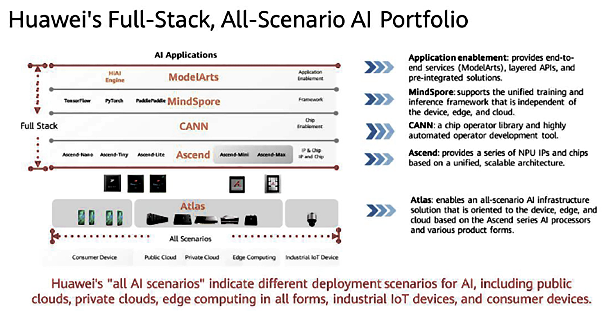

# Lesson 3 Huawei’s AI strategy & open AI capabilities from Huawei Cloud EI
Huawei Technologies Co., Ltd. is a leading global provider of information and communications technology (ICT) infrastructure and smart devices. Founded in 1987 by Ren Zhengfei in Shenzhen, China, Huawei has grown into one of the world’s largest tech companies, specializing in telecommunications equipment, consumer electronics, cloud computing, and AI-driven solutions. Known for its cutting-edge innovations in 5G networks, smartphones (Mate & P series), and enterprise solutions, Huawei has faced significant geopolitical challenges, particularly from the U.S., which has restricted its access to key technologies over security concerns. Despite these hurdles, Huawei continues to invest heavily in R&D (ranking among the top global spenders), with breakthroughs in HarmonyOS, Ascend AI processors, and optical networking. The company operates in over 170 countries, advocating for a "fully connected, intelligent world" while navigating complex debates around cybersecurity, digital sovereignty, and technological self-reliance.

**Key Highlights**:
- **5G Leadership**: Dominates global telecom infrastructure with patented 5G tech.
- **Consumer Tech**: Flagship smartphones, wearables, and HarmonyOS ecosystem.
- **AI & Cloud**: Ascend AI chips and Huawei Cloud compete with AWS/Azure.
- **Controversies**: U.S. sanctions, espionage allegations, and global supply chain bans.
- **Global Reach**: Serves 3+ billion people, 197,000 employees, $92B revenue (2023).

## Huawei Cloud EI (Enterprise Intelligence) Portfolio
Huawei Cloud Enterprise Intelligence (EI) is a comprehensive AI platform designed to empower businesses with cutting-edge artificial intelligence capabilities. Built on Huawei’s advanced Ascend AI processors and cloud infrastructure, EI integrates AI services across industries—enabling enterprises to accelerate digital transformation with natural language processing (NLP), speech recognition, optical character recognition (OCR), computer vision, and predictive analytics.

### Vision & Mission
- **Vision**: "Make AI ubiquitous, affordable, and scalable for every enterprise."
- **Goal**: Provide industry-ready AI solutions that enhance efficiency, automate workflows, and drive innovation.

### Why Huawei Cloud EI?
- Powered by Ascend AI & Kunpeng Chips – High-performance AI acceleration.
- Pre-trained Industry Models – Ready-to-deploy solutions for finance, healthcare, retail, and more.
- Hybrid Cloud Integration – Seamless deployment on public, private, or edge clouds.
- Global Compliance – Meets GDPR and regional data security standards.

## Key AI Services in Huawei Cloud EI

| Service Category | Key Features | Industry Applications |
|------------------|-------------|-----------------------|
| **Natural Language Processing (NLP)** | Text analysis, sentiment detection, machine translation, chatbot engines | Customer support automation, multilingual content processing, social media monitoring |
| **Speech AI** | Automatic Speech Recognition (ASR), Text-to-Speech (TTS), real-time transcription | Call center analytics, voice assistants, audio content generation |
| **Optical Character Recognition (OCR)** | Document digitization, ID/license recognition, handwritten text extraction | Banking (KYC), logistics (invoice processing), healthcare records management |
| **Computer Vision** | Image classification, object detection, facial recognition | Smart retail (inventory tracking), manufacturing (quality control), traffic monitoring |
| **Predictive Analytics** | Time-series forecasting, anomaly detection, recommendation systems | Financial fraud prevention, supply chain optimization, personalized marketing |

Huawei Cloud EI helps businesses automate processes, enhance decision-making, and unlock AI-driven growth—whether through AI-powered call centers, smart document processing, or real-time visual analytics.

## ModelArts
ModelArts, developed by Huawei Cloud, is a one-stop AI development platform designed to empower developers and data scientists of all skill levels to build, train, and deploy machine learning models efficiently across cloud, edge, and device environments. In 2025, it supports the full AI development lifecycle, including data preprocessing, semi-automated labeling, distributed training, automated model building, and one-click deployment, accelerating innovation in industries like healthcare (e.g., automated medical report interpretation), finance (e.g., fraud detection), and transportation (e.g., autonomous driving control). ModelArts leverages heterogeneous computing resources, including Huawei’s Ascend AI chips and mainstream GPUs, and supports open-source frameworks like TensorFlow, PyTorch, and MindSpore, alongside its MoXing deep learning framework for high-performance training. Its ExeML feature enables code-free model creation for image classification, object detection, and predictive analytics, making AI accessible to non-experts. With a 50% boost in development efficiency through end-to-end toolchains, robust data privacy in Europe (Open Telekom Cloud), and capabilities like intelligent diagnosis and model optimization (e.g., heat maps, ROC curves), ModelArts addresses adoption barriers like cost and complexity but faces challenges in competing with platforms like AWS SageMaker due to regional regulatory differences and infrastructure costs.

### Key Capabilities
Automated Machine Learning (AutoML): Enables users with limited ML expertise to build high-accuracy models using automated data labeling, feature engineering, and hyperparameter tuning.
Flexible Development Frameworks: Supports TensorFlow, PyTorch, MindSpore (Huawei’s native framework), and Scikit-learn, allowing seamless integration with existing workflows.
Distributed Training: Accelerates model training with multi-GPU/CPU clusters and Huawei’s Ascend 910 AI processors, significantly reducing training time for large datasets.
Model Zoo & Pre-trained Models: Offers 100+ industry-ready models for computer vision (CV), natural language processing (NLP), speech recognition, and more—optimized for quick deployment.
Hybrid & Edge Deployment: Supports cloud, on-premises, and edge deployment via containers, APIs, or integration with HiLens for edge AI applications.

### Industry Applications
ModelArts is widely used across sectors, including:
- **Healthcare**: Medical imaging analysis (e.g., tumor detection).
- **Manufacturing**: Predictive maintenance and defect detection.
- **Finance**: Fraud detection and risk assessment.
- **Retail**: Personalized recommendations and inventory automation.

### Why Choose ModelArts?
- **End-to-End Pipeline**: Covers data → training → deployment → monitoring.
- **Cost-Effective**: Pay-as-you-go pricing with optimized resource usage.
- **Enterprise-Grade Security**: Compliant with global data protection standards (GDPR, etc.).
- **Seamless Integration**: Works with Huawei HiLens, GaussDB, and Huawei Cloud EI for full-stack AI solutions.

## Huawei HiLens
Huawei HiLens is a multimodal AI development and runtime management platform that facilitates device-cloud synergy, enabling developers to create, deploy, and manage visual and auditory AI applications across diverse scenarios like smart homes, retail, campuses, and transportation. Launched by Huawei Cloud, HiLens integrates with the ModelArts platform to support seamless model development, allowing direct import of models trained in ModelArts or offline in formats like Caffe, which are converted to OM models for Huawei’s Ascend 310 and HiSilicon 35xx series chips. It offers a developer-friendly framework with unified APIs, a cloud-based management console, and a skill market providing pre-built AI skills (e.g., face detection, license plate recognition) for one-click deployment. HiLens Kit cameras and AI edge stations, capable of processing up to 16 video channels, support real-time analysis with low latency and reduced cloud storage costs through end-side computing, making it ideal for applications like intelligent surveillance and in-vehicle systems. In 2025, HiLens serves three user types—ordinary users (e.g., homeowners for security), AI developers (building custom skills), and camera manufacturers (enhancing device AI capabilities)—but faces challenges like high development costs, regional regulatory compliance (e.g., GDPR in Europe), and competition from platforms like AWS SageMaker. Its integration with Huawei’s ecosystem and focus on reducing AI development barriers through tools like HiLens Studio and ModelBox positions it as a key player in the global AI market, particularly in Asia-Pacific.

**Purpose**: Deploys optimized AI models to edge devices (cameras, IoT sensors).

### Key Features:
**Device Management**: Unified control for edge devices.
**Skill Marketplace**: Pre-trained AI skills (e.g., face recognition, anomaly detection).
**Framework Support**: Compatible with ModelArts-trained models.

### Integration Workflow

**Why Integrate?**
- Seamless Transition: Train in ModelArts → Optimize for edge → Deploy via HiLens.
- Performance: HiLens reduces latency by processing data locally (critical for real-time apps).
- Unified Management: Monitor all edge devices and models from a single console.

**Use Case Example: Smart Retail**
- Train a product recognition model in ModelArts.
- Convert to HiLens-optimized format (e.g., OM model).
- Deploy to store cameras via HiLens for real-time shelf monitoring.

## ModelArts vs HiLens Comparison

| Feature                | ModelArts                          | HiLens                              |
|------------------------|-----------------------------------|-------------------------------------|
| **Primary Purpose**    | Cloud-based AI development platform | Edge AI deployment platform        |
| **Workflow Stage**     | Training & development            | Inference & execution              |
| **Target Environment** | Cloud servers/GPU clusters        | Edge devices (cameras, IoT)        |
| **Key Strengths**      | • AutoML • Distributed training • Model zoo | • Low-latency inference • Pre-built skills • Device management |
| **Model Optimization** | Hyperparameter tuning             | Model quantization & pruning       |
| **Deployment Speed**   | Minutes (container/API-based)     | Seconds (pre-installed skills)     |
| **Supported Frameworks** | TensorFlow, PyTorch, MindSpore   | Optimized for edge models          |
| **Use Case Example**   | Training CV model for defect detection | Running model on factory cameras  |
| **Integration**        | Can export models to HiLens       | Receives models from ModelArts     |
| **Pricing Model**      | Pay-as-you-go (compute hours)     | Per device/skill licensing         |

## Huawei’s Global AI Initiatives
Huawei’s Global AI Initiatives in 2025 are a cornerstone of its "All Intelligence" strategy, aimed at accelerating digital transformation and fostering an AI-driven ecosystem across industries and regions, despite U.S. sanctions. Launched at Huawei Connect 2023 and expanded in 2024, these initiatives leverage Huawei’s Ascend AI chips (e.g., Ascend 910C and 910D) and Pangu models to deliver industry-specific solutions in sectors like healthcare, finance, mining, automotive, and education, aligning with global goals like Saudi Arabia’s Vision 2030 and Uzbekistan’s AI Development Strategy 2030. Key efforts include the Huawei Cloud Ascend AI Cloud Service, which supports model training and inference for applications like autonomous driving (e.g., ADS 3.0 reducing learning cycles to under two days) and smart mining (e.g., Shandong Energy Group’s 8,000-ton annual coal increase). Huawei’s ModelArts and HiLens platforms enhance AI development and deployment, enabling device-cloud synergy for real-time applications like intelligent surveillance and in-vehicle systems. The company invests heavily in AI infrastructure, with over $140 million annually in AI data center R&D and a 70,000 m² lab, while its RASTM framework ensures reliable, agile, and sustainable AI data centers. Additionally, Huawei fosters talent through the ICT Competition 2024–2025, engaging over 210,000 students globally, and supports sustainable development by integrating AI with 5G-Advanced networks (Net5.5G) for energy-efficient solutions. Despite challenges like low chip yields (e.g., 20% for Ascend 910C due to U.S. restrictions on EUV technology) and regulatory hurdles, Huawei’s initiatives, including partnerships with firms like Zode and Zhipu AI, position it as a key player in the global AI market, challenging Nvidia’s dominance and driving innovation in regions like the Middle East, Central Asia, and the Global South.

### Research & Academia
| Initiative                          | Description                                      | Region       |
|-------------------------------------|--------------------------------------------------|--------------|
| **Huawei Innovation Research Program (HIRP)** | Funds AI research at 300+ top universities | Global       |
| **Ascend AI Ecosystem**             | Partners with 50+ universities for AI curriculum | Europe/Asia/Africa |
| **AI for Good**                     | Supports UN SDGs through AI projects            | Worldwide    |

### Infrastructure & Cloud
| Component           | Deployment Scale                      | Key Feature                     |
|---------------------|---------------------------------------|---------------------------------|
| Huawei Cloud EI     | 30+ global regions                   | Industry-specific AI services   |
| Ascend AI Chips     | 15+ national supercomputing centers  | 256 TOPS computing power       |
| ModelArts           | 10,000+ enterprise users             | One-stop AI development platform|

### Industry Applications
| Sector        | Project Example                     | Impact                          |
|---------------|-------------------------------------|---------------------------------|
| Healthcare    | Pangu Drug Model                   | 100+ hospitals adopting         |
| Smart Cities  | AI traffic optimization            | Implemented in Dubai/Bangkok    |
| Agriculture   | AI crop monitoring systems         | Pilots in Kenya/Brazil          |

### Strategic Partnerships
| Partner Type     | Example Collaborations             | Focus Area                     |
|------------------|------------------------------------|--------------------------------|
| Automotive       | BMW, SAIC                         | Autonomous driving             |
| Telecom          | Vodafone, MTN                     | 5G+AI solutions                |
| Startups         | Spark Program (500+ annual)       | AI innovation funding          |

### Open Source Contributions
| Project       | GitHub Stars | Key Feature                      |
|--------------|-------------|----------------------------------|
| MindSpore    | 10k+        | Full-stack AI framework          |
| Model Zoo    | 500+ models | Pre-trained industry solutions   |

## Huawei`s Full-Stack, All Scenario AI Portfolio
Huawei’s Full-Stack, All-Scenario AI Portfolio in 2025 is a comprehensive suite of AI solutions designed to empower industries and developers worldwide, integrating hardware, software, and services to enable seamless AI development and deployment across cloud, edge, and device environments. Anchored by Huawei’s Ascend AI chips (e.g., Ascend 910C and 910D), the portfolio includes the ModelArts platform for streamlined model development, training, and deployment; HiLens for multimodal AI applications like intelligent surveillance and autonomous driving; and the Pangu models, which support industry-specific solutions in healthcare (e.g., medical report analysis), finance (e.g., fraud detection), and smart mining (e.g., Shandong Energy Group’s efficiency gains). The Huawei Cloud Ascend AI Cloud Service facilitates large-scale model training and inference, while tools like CANN (Compute Architecture for Neural Networks) and MindSpore, an open-source deep learning framework, enhance performance and accessibility. The portfolio supports diverse scenarios, from smart cities and campuses to in-vehicle systems, leveraging device-cloud synergy for real-time processing with low latency. Huawei’s Reliable, Agile, and Sustainable Data Infrastructure (RASTM) ensures efficient AI data centers, with over $140 million invested annually in R&D and a 70,000 m² lab driving innovation. Despite challenges like U.S. sanctions impacting chip yields (e.g., 20% for Ascend 910C) and regulatory complexities (e.g., GDPR compliance), Huawei’s portfolio, backed by global initiatives like the ICT Competition and partnerships with firms like Zode, positions it as a competitive alternative to Nvidia and AWS, driving AI adoption in regions like the Middle East, Central Asia, and the Global South, aligning with national strategies such as Saudi Arabia’s Vision 2030.

