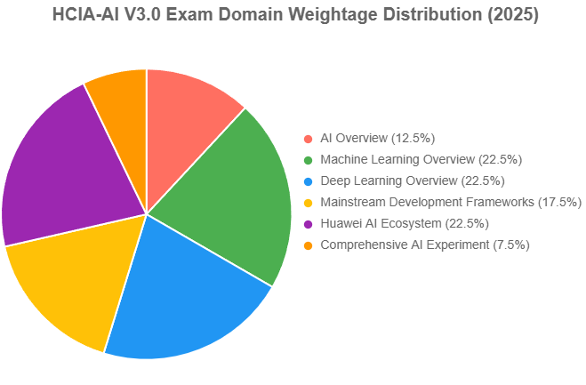

# Lesson 4 Huawei AI Certification Overview
Huawei’s AI Certification program, part of its "Platform + AI + Ecosystem" strategy, is designed to cultivate skilled AI professionals by providing comprehensive training and validation of expertise in artificial intelligence technologies, aligning with the 2025 global AI market’s growth to USD 279.22–391 billion. The flagship **Huawei Certified ICT Associate – Artificial Intelligence (HCIA-AI V3.0)** certification targets engineers and developers, equipping them with foundational AI knowledge, including machine learning, deep learning, and Huawei’s AI ecosystem (e.g., ModelArts, MindSpore, Ascend chips). The program covers AI history, algorithms, TensorFlow and MindSpore frameworks, and Huawei’s full-stack solutions like the Atlas platform and Huawei Cloud EI, with practical skills in data preprocessing, model building, and deployment for applications like image recognition and autonomous driving. Offered through Huawei Authorized Learning Partners (HALPs) and tested via Pearson VUE, the HCIA-AI exam includes multiple-choice, true/false, and hands-on lab components, with e-certificates issued post-exam. Higher-level certifications like HCIP-AI and HCIE-AI cater to advanced professionals, focusing on complex AI solutions and system optimization. In 2025, Huawei’s ICT Competition engages over 210,000 students globally, fostering talent, but challenges include regional exam restrictions (e.g., China’s OnVUE prohibition) and competition from certifications like AWS Certified Machine Learning.

## HCIA-AI Exam Structure (V3.0)

### Exam Domain Weightage
| Domain | Weight | Key Topics |
|--------|--------|------------|
| **AI Concepts & History** | 15% | - AI definitions - AI development milestones - Huawei's AI strategy |
| **Machine Learning Fundamentals** | 25% | - Supervised/unsupervised learning - Common algorithms (k-NN, SVM) - Evaluation metrics |
| **Deep Learning Basics** | 20% | - Neural networks - CNN/RNN concepts - Training processes |
| **Huawei AI Solutions** | 30% | - ModelArts platform - Ascend chips - HiLens edge computing |
| **AI Ethics & Safety** | 10% | - Responsible AI principles - Data privacy (GDPR) |

### Exam Format
| Attribute | Detail |
|-----------|--------|
| **Question Types** | Multiple-choice (single/multi-answer), drag-and-drop, scenario-based |
| **Total Questions** | 60-70 |
| **Duration** | 90 minutes |
| **Passing Score** | 600/1000 |
| **Languages** | English, Chinese |

### Preparation Tips
- Focus on **Huawei's official study guide** (covers 100% of exam objectives)
- Practice with **free ModelArts sandbox** (5+ hrs recommended)
- Review **Ascend 310 vs 910 chip comparisons**

## Question Type Analysis
The Huawei Certified ICT Associate – Artificial Intelligence (HCIA-AI V3.0) exam (H13-311) features a diverse set of question types designed to assess both theoretical knowledge and practical skills in AI and Huawei’s AI ecosystem, aligning with the 2025 global AI market’s demand for skilled professionals. The exam, typically comprising around 60 questions over 90 minutes, includes single-answer multiple-choice questions (testing concepts like AI history and machine learning algorithms), multiple-answer multiple-choice (evaluating complex scenarios involving frameworks like TensorFlow or MindSpore), true/false questions (assessing foundational AI knowledge), short-answer questions (requiring concise explanations of processes like model training in ModelArts), and drag-and-drop items (focusing on hands-on tasks such as configuring Ascend chip-based workflows or deploying models via Huawei Cloud EI). This mix ensures comprehensive evaluation across domains like AI Overview (10–15%), Machine Learning (20–25%), Deep Learning (20–25%), Development Frameworks (15–20%), Huawei AI Ecosystem (20–25%), and AI Experiments (5–10%), with a strong emphasis on practical application using Huawei tools like ModelArts and Atlas. The variety of question types, particularly the hands-on drag-and-drop and short-answer formats, challenges candidates to demonstrate proficiency in real-world AI tasks, but the technical complexity and Huawei-specific focus can pose difficulties for those unfamiliar with Ascend or MindSpore, necessitating targeted preparation through Huawei’s training resources and labs.

## Learning strategy and revision

### Learning Strategy
A robust learning strategy for the HCIA-AI V3.0 exam should balance theoretical understanding, practical skills, and familiarity with Huawei’s AI ecosystem, tailored to the candidate’s background (e.g., beginner or intermediate in AI). Begin by building foundational knowledge through Huawei’s official resources, such as the HCIA-AI V3.0 training courses offered via Huawei Authorized Learning Partners (HALPs) or the Huawei Cloud Developer Institute, which cover AI history, machine learning algorithms, and Huawei tools like ModelArts and MindSpore. Dedicate 40% of study time to high-weightage domains (Machine Learning, Deep Learning, Huawei AI Ecosystem, each ~22.5%), focusing on hands-on labs for tasks like data preprocessing, model training with MindSpore, and deployment via ModelArts. Allocate 30% to Development Frameworks (17.5%) and AI Overview (12.5%), mastering Python programming, TensorFlow, PyTorch, and AI evolution concepts through online tutorials (e.g., Coursera, Udemy) and Huawei’s pre-courses on Python Basics and Mathematics (linear algebra, probability). Spend 20% on Comprehensive AI Experiments (7.5%), practicing drag-and-drop and short-answer tasks using Huawei’s practice labs or platforms like HCDATest and 591Lab. To address prerequisites, ensure proficiency in Linux operations and Python, using resources like freeCodeCamp for coding practice. Study in structured 2–3 hour daily sessions over 8–12 weeks, combining video lectures (1 hour), reading (1 hour), and hands-on labs (1 hour) to reinforce theory with practice. Join Huawei’s ICT Community forums or study groups to clarify doubts and stay updated on Huawei-specific tools like Ascend chips and Atlas platforms. Regularly assess progress with practice exams to identify weak areas, aiming for a 70% score before attempting the final exam.

### Revision Plan
The revision plan for the HCIA-AI V3.0 exam should be a focused 4–6 week process, starting 6 weeks before the exam date, to consolidate knowledge and enhance exam readiness. 
- **Week 1–2: Review Core Concepts**—Revisit high-weightage domains (Machine Learning, Deep Learning, Huawei AI Ecosystem) using Huawei’s official study guides and summarized notes. Create flashcards for key concepts (e.g., supervised vs. unsupervised learning, Ascend 910C architecture, ModelArts’ ExeML) and review them daily for 30 minutes.
- **Week 3: Framework and Practical Focus**—Dedicate time to Development Frameworks and AI Experiments, practicing coding tasks in Python, TensorFlow, and MindSpore via Huawei’s labs or Jupyter notebooks. Complete at least 2–3 hands-on projects (e.g., building an image classification model with ModelArts) to master drag-and-drop and short-answer question types.
- **Week 4: Mock Exams and Weak Areas**—Take full-length practice exams on platforms like HCDATest or 591Lab, simulating the 90-minute format with 60 questions. Analyze results to target weak domains (e.g., if scoring low on Deep Learning, review neural network architectures like CNNs). Allocate 1–2 hours daily to revisit weak topics using Huawei’s training videos or community forums.
- **Week 5: Intensive Revision**—Focus on Huawei AI Ecosystem specifics (e.g., HiLens for video analysis, Atlas for edge computing) and practical scenarios, practicing 10–15 drag-and-drop and short-answer questions daily. Review AI Overview for quick wins, memorizing milestones and ethical issues.
- **Week 6: Final Prep and Confidence Building**—Take 2–3 additional mock exams, aiming for 75–80% accuracy to exceed the passing score (~60%). Revise flashcards, focus on time management (1.5 minutes per question), and ensure familiarity with Pearson VUE’s interface. Rest the day before the exam to maintain focus. Throughout, dedicate 1 hour weekly to staying updated on Huawei’s AI advancements (e.g., via Huawei Connect 2024 resources) to contextualize ecosystem questions. Address challenges like technical complexity by breaking study into manageable chunks and using visual aids (e.g., mind maps for algorithms).
