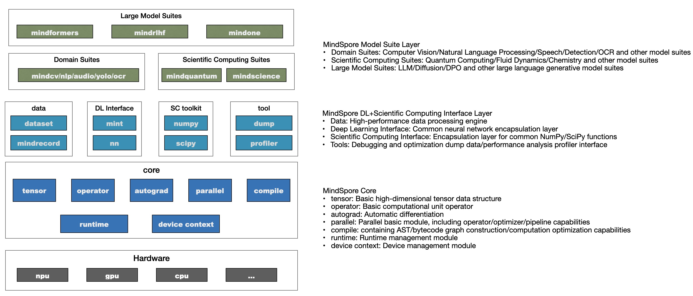
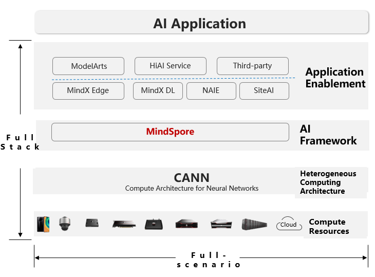

# [Huawei MindSpore AI Framework](https://www.mindspore.cn/en)

[Huawei MindSpore](https://www.mindspore.cn/en) is an open-source deep learning framework designed for training and inference across mobile, edge, and cloud scenarios. Written in C++ and compatible with Python, it operates under the Apache-2.0 license, allowing users to freely use, modify, and distribute the software. MindSpore aims to simplify AI development by offering a unified programming interface, seamless integration with frameworks like TensorFlow and PyTorch, and visual tools to lower entry barriers for developers. It supports Huawei’s Ascend AI processors, as well as GPUs and CPUs, ensuring efficient execution through software-hardware co-optimization.

## What is MindSpore?
- An open-source, full-stack AI framework by Huawei for device-edge-cloud AI development.
- Optimized for Ascend AI processors (Huawei’s NPUs) but also supports GPUs/CPUs.
- Competes with TensorFlow, PyTorch, and ONNX Runtime.

## Why Use MindSpore?
- Efficient (operator fusion, memory optimization)
- Cross-platform (cloud, edge, IoT via MindSpore Lite)
- Enterprise-ready (used in Huawei Cloud, 5G, smart cities)
- Open-source (Apache 2.0 license)
  
## Architecture
The overall architecture of MindSpore is as follows:
- **Model Suite**: Provides developers with ready-to-use models and development kits, such as the large model suite MindSpore Transformers, MindSpore ONE, and scientific computing libraries for hot research areas;
- **Deep Learning + Scientific Computing**: Provides developers with various Python interfaces required for AI model development, maximizing compatibility with developers' habits in the Python ecosystem;
- **Core**: As the core of the AI framework, it builds the Tensor data structure, basic operation operators, autograd module for automatic differentiation, Parallel module for parallel computing, compile capabilities, and runtime management module.

## Huawei Ascend AI Full-Stack Solution
Ascend computing is a full-stack AI computing infrastructure and application based on the Ascend series processors. It includes the Ascend series chips, Atlas series hardware, CANN chip enablement, MindSpore AI framework, ModelArts, and MindX application enablement.

Huawei Atlas AI computing solution is based on Ascend series AI processors and uses various product forms such as modules, cards, edge stations, servers, and clusters to build an all-scenario AI infrastructure solution oriented to device, edge, and cloud. It covers data center and intelligent edge solutions, as well as the entire inference and training processes in the deep learning field.

Th Ascend AI full stack is shown below:

## Three Key Technologies:
- **Unified Model IR**: Adapts to different language scenarios and custom data structures for consistent deployment.link.springer.com
- **Software-Hardware Collaboration**: Optimizes graph execution to minimize scenario differences, leveraging Huawei’s Ascend chips.link.springer.com
- **Device-Cloud Federated Meta-Learning**: Enables real-time multi-device model updates, improving personalized model accuracy.link.springer.com

## Modular Architecture:
- **MindExpress (ME)**: Python-based frontend for algorithm expression, with plans for C++, Java, and Huawei’s Cangjie language.mindspore.cn
- **MindCompiler**: Handles hardware-independent (e.g., automatic differentiation) and hardware-related optimizations (e.g., parallelism, memory optimization).mindspore.cn
- **MindRT**: Manages runtime execution for efficient model deployment.mindspore.cn
- **ModelZoo**: Offers pre-built deep learning models, encouraging community contributions.mindspore.cn

## AI Vision and Decision-Making

MindSpore’s computational graph is a dynamic, versatile representation of neural network operations, forming the backbone for tasks like computer vision (CV). Its execution engine translates these graphs into optimized commands, ensuring seamless performance across hardware. For AI vision, MindSpore supports tasks like image classification and object detection by providing pre-trained models and efficient operators/kernels tailored for CV. The framework’s decision-making process relies on its ability to optimize computational graphs and leverage federated meta-learning, enabling real-time updates and high accuracy in vision-based applications, such as improving wrist-lift recognition on Huawei Watch GT by 80% with minimal latency.viso.aihuaweicentral.com

## Benefits and Community

- **Ease of Development**: User-friendly APIs, transparent debugging, and a 20% reduction in code complexity make it accessible to beginners and experts.huawei.com
- **Performance**: Optimizations like automatic parallelism reduce training time (e.g., 23% faster for ResNet-50, 62% for BERT).cio.com
- **Open Ecosystem**: Open-sourced in March 2020, MindSpore has a growing community with over 170,000 developers and supports collaboration via GitHub, Gitee, and forums.huaweicentral.com
- **Applications**: Widely used in CV, NLP, and audio tasks, with real-world applications like Huawei’s PanGu-Σ LLM and smart device feature

## Important Links

[Website Link](https://www.mindspore.cn/en)

[GitHUb Repo Link](https://github.com/mindspore-ai/mindspore)
